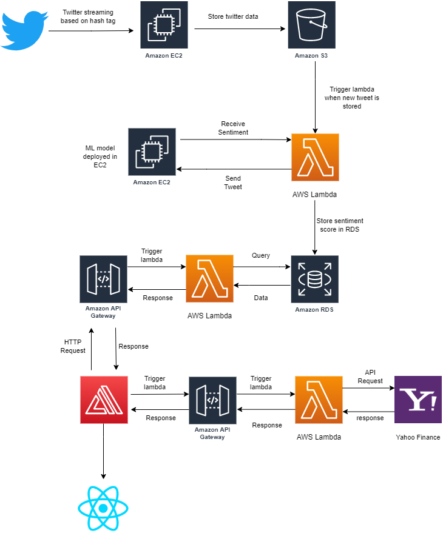

# Stock Sentimental Analysis 
> Written by
> Binay Gurung, Umakant Datt Bhatt, Kashish Jagtiani, Aayush Shrestha

The main idea of our project is to utilize the Twitter API to perform qualitative sentimental analysis on the tweets of a given company and monitor the performance of its stock based on the number of positive sentiment tweets, the number of negative sentiment tweets and the net sentiment, to show a relation between tweets and a company's stocks. We will be using data from the API to conduct a qualitative analysis and present the analyzed data on a frontend application. 

The following represents the AWS services of our application.

Access our application by visiting https://main.do9ra6o2orift.amplifyapp.com/ while our pocket money lasts. :wink:
